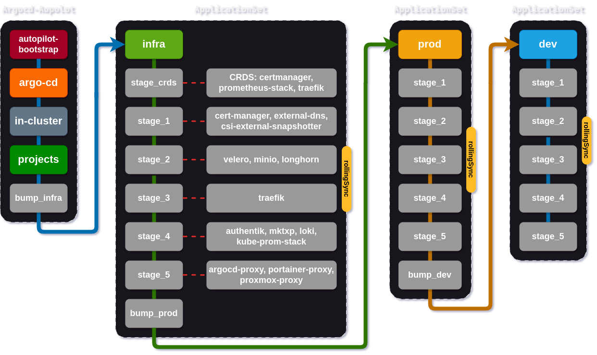

# About the project

The goal of this project is to deploy a K3s cluster using **Ansible**, [kustomize](https://kustomize.io/) and **ArgoCD Autopilot**.

# Related repositories

The project consists of multiple repositories, deployment is fully automated, the cluster can be redeployed in minutes as many times as required.

Please check the following repository for more information:

| Name                  | Description                                                              |
| --------------------- | ------------------------------------------------------------------------ |
| [k3s-ansible](https://github.com/JacekZubielik/k3s-ansible)          | Automated build of `k3s` cluster with `kube-vip` and `MetalLB` or `Cilium` via `ansible`. |
| [dev-k3s-lab-autopilot](https://github.com/JacekZubielik/dev-k3s-lab-autopilot) | Deploying applications to the clusters with  ArgoCD Autopilot.           |
| [jz-helm-charts](https://github.com/JacekZubielik/jz-helm-charts)        | Personal Helm charts for applications deployed to the clusters           |

# Sensitive data

Sensitive data in this project is encrypted using SOPS - [Secrets OPerationS](https://github.com/mozilla/sops), which integrates with both **age** and **GPG** encryption tools.

The implementation utilizes a dual encryption approach where:

- **age** (simple, modern encryption tool)
- **GPG** (GNU Privacy Guard)

The plugin **kSOPS** used for **Kustomize** allows **ArgoCD** to automatically decrypt secrets when provided with the key.

# ArgoCd

The command `make deploy-all` will deploy the **ArgoCD Autopilot** manifest to the target cluster.

This application will then manage the **ArgoCD** installation autonomously, so you will have an **ArgoCD** that is self-managed.

**Directory structure**

```
├── /apps [4]
│   ├── /dev
│   ├── /infra
│   └── /prod
├── /bootstrap [2]
├── Makefile [1]
└── /projects [3]
   ├── bootstrap.yaml
   ├── crds.yaml
   ├── dev.yaml
   ├── infra.yaml
   ├── iot.yaml
   ├── media.yaml
   ├── monitoring.yaml
   └── storage.yaml
```

[1]  `Makefile` starts the implementation.
[2]  `/bootstrap`
[3]  `/projects` contains ApplicationSets for deploying applications.
[4]   `/apps` allows controlling the order of application deployment in each **ApplicationSet**:  `infra`,  `prod`, `dev`

## Progressive Syncs



[**Progressive Syncs**](https://argo-cd.readthedocs.io/en/stable/operator-manual/applicationset/Progressive-Syncs/)  is a feature that allows you to control the order in which the `ApplicationSet` controller creates or updates applications. This functionality aims to provide greater flexibility and control over the application update process.

**ProgressiveSync** will create applications and synchronize them in the order specified in the **ApplicationSet** `spec.strategy.rollingSync.steps` list. If all generated applications receive an update during the refresh interval, then progressive synchronization will update the application step by step according to the corresponding matching label.

**Application Health Management**: This feature monitors the health status of managed applications and proceeds to the next stage of the update only when the applications achieve a "**Healthy**" status. Various resource types are supported, including **Deployments**, **DaemonSets**, and **StatefulSets**.

**Update Strategies**:

**AllAtOnce**: The default strategy where all applications are updated simultaneously.

**RollingSync**: Allows grouping applications by labels and sequentially applying changes to each group, where all applications in a group must be healthy before moving on to the next group.

[](https://odysee.com/$/embed/@dev-k3s-lab-autopilot:6/dev-k3s-lab-autopilot:3?r=2exiFW5MjKi3cxzuB8VRhiE6E8khvcP8)

## ApplicationSet

The presented code is a definition of a resource of type **ApplicationSet**: `infra` in **ArgoCD**, which is a tool for managing applications in **Kubernetes** using the GitOps approach.

This code defines a comprehensive automation mechanism for managing applications in **ArgoCD** by utilizing `ApplicationSet`. It enables dynamic generation of applications from **Git** repositories and managing them in a declarative manner. By using **Go** templates and various generators, such as the **Git generator**, it is easy to customize and extend configurations for different environments and needs.

Below is a detailed description of the individual sections of this code.

### Metadata

```yaml
metadata:
  labels:
    dev-k3s: infra
  name: infra
  namespace: argocd
```

- **labels**: The label `dev-k3s: infra` allows for categorizing the object in the context of the environment.
- **name**: The resource name.
- **namespace**: The resource is placed in the `argocd` namespace.

### Specification

```yaml
spec:
  goTemplate: true
  goTemplateOptions: ["missingkey=error"]
```

- **goTemplate**: Allows using **Go** templates to build applications.
- **goTemplateOptions**: The option `missingkey=error` causes missing keys in the template to result in an error, making debugging easier.

### Generators

```yaml
generators:
- git:
    repoURL: https://github.com/JacekZubielik/dev-k3s-lab-autopilot.git
    requeueAfterSeconds: 4
    revision: ""
    files:
    - path: apps/infra/**/config.yaml
```

- **git**: A generator based on a Git repository that monitors changes in files.
- **repoURL**: The address of the repository from which configuration files will be fetched.
- **requeueAfterSeconds**: The time to recheck the repository after 4 seconds.
- **files**: The path to the configuration files that will be used for application generation.

### Application template

```yaml
template:
  metadata:
    annotations:
      argocd.argoproj.io/sync-wave: '{{ .syncWave }}'
    labels:
      app.kubernetes.io/managed-by: argocd-autopilot
      app.kubernetes.io/name: '{{ .appName }}'
      application-role: '{{ .appRole }}'
      syncPriority: '{{ .syncPriority }}'
    name: infra-{{ .userGivenName }}
    namespace: argocd
```

- **metadata**: Defines the metadata for generated applications, such as labels and annotations.
- **sync-wave**: Allows control over the order of application synchronization.
- **name**: The name of the application dynamically created based on variables.

### Application specifications

```yaml
spec:
  project: '{{ .destProject }}'
  source:
    path: '{{ .srcPath }}'
    repoURL: '{{ .srcRepoURL }}'
    targetRevision: '{{ .srcTargetRevision }}'
  destination:
    namespace: '{{ .destNamespace }}'
    server: '{{ .destServer }}'
```

- **project**: The project to which the application belongs.
- **source**: The source of the application manifests, specifying the path and repository.
- **destination**: Specifies where the application is to be deployed (namespace and server).

### Ignoring differences

```yaml
ignoreDifferences:
- group: argoproj.io
  kind: Application
  jsonPointers:
  - /status
```

Allows to ignore differences in certain fields of Kubernetes objects during synchronization.

### Synchronization policy

```yaml
syncPolicy:
  automated:
    selfHeal: true
    prune: true
```

- **automated**: Allows automatic synchronization of applications and removal of outdated resources.

### Synchronization strategy

```yaml
strategy:
  type: RollingSync
  rollingSync:
    steps:
    - matchExpressions: # ----------> stage_crds
      - key: syncPriority
        operator: In
        values:
        - stage_crds
      maxUpdate: 100%
    - matchExpressions: # ----------> stage_1
      - key: syncPriority
        operator: In
        values:
        - stage_1
      maxUpdate: 100%
    - matchExpressions: # ----------> stage_2
      - key: syncPriority
        operator: In
        values:
        - stage_2
      maxUpdate: 100%
    - matchExpressions: # ----------> stage_3
      - key: syncPriority
        operator: In
        values:
        - stage_3
      maxUpdate: 100%
    - matchExpressions: # ----------> stage_4
      - key: syncPriority
        operator: In
        values:
        - stage_4
      maxUpdate: 100%
    - matchExpressions: # ----------> stage_5
      - key: syncPriority
        operator: In
        values:
        - stage_5
      maxUpdate: 100%
    - matchExpressions: # ----------> bump_prod
      - key: syncPriority
        operator: In
        values:
        - bump_prod
      maxUpdate: 100%
```

- **type**: `RollingSync`: Application update strategy that allows for gradual implementation of changes based on synchronization priorities.
- **maxUpdate** =`100%`, It means that all matched applications are updated together as a group.

```yaml
annotations: ''
appName: external-dns
appRole: infra
destNamespace: external-dns
destProject: "infra"
destServer: https://kubernetes.default.svc
exclude: ""
include: ""
labels: ""
srcPath: apps/infra/external-dns
srcRepoURL: https://github.com/JacekZubielik/dev-k3s-lab-autopilot.git
srcTargetRevision: ""
syncPriority: stage_1
syncWave: 0
userGivenName: external-dns
```

```
/apps
├── /dev
│   ├── application-set.yaml
│   ├── config-dir.yaml
│   ├── /binance-proxy
│   ├── /home-assistant
│   ├── /intel-nfd
│   ├── /loki
│   ├── /mosquitto
│   ├── /uptime-kuma
│   └── /zigbee2mqtt
├── /infra
│   ├── application-set.yaml
│   ├── /argocd-proxy
│   ├── /authentik
│   ├── /bootstrap-bump
│   ├── /cert-manager
│   ├── /crds-cert-manager
│   ├── /crds-prometheus-stack
│   ├── /crds-traefik
│   ├── /csi-external-snapshotter
│   ├── /external-dns
│   ├── /homepage
│   ├── /kube-prometheus-stack
│   ├── /kustomization.yaml
│   ├── /longhorn
│   ├── /minio
│   ├── /mktxp
│   ├── /portainer-proxy
│   ├── /proxmox-proxy
│   ├── /traefik
│   └── /velero
└── /prod
   ├── application-set.yaml
   ├── kustomization.yaml
   ├── /bootstrap-bump
   ├── /jellyfin
   └── /syncthing
```

The `make deploy-all` command is used to bootstrap kubernetes and ArgoCD Autopilot and to deploy all applications.

## Usage

```
Usage:
  make <target>
  kubeconfig          Copy 'kubeconfig'.
  sops                Import a sops AGE and PGP secret keys.
  autopilot           Deploy Argo CD autopilot recovery on Kubernetes cluster.
  password-argocd     Show admin password for ArgoCD.
  password-grafana    Show admin password for Grafana.
  login-argocd        Login to ArgoCD CLI.
  help                Display this help.
```

## Applications and technologies

### infrastructure

- [Ansible](https://www.ansible.com/) - Configuring the virtual machines and installing k3s.
- [ArgoCD Autopilot](https://argo-cd.readthedocs.io/) - GitOps tool for deploying applications to the clusters.
- [GitHub Actions](https://docs.github.com/en/actions) - Customized workflow.
- [Kustomize](https://kubernetes.io/docs/tasks/manage-kubernetes-objects/kustomization) - Declarative Management of Kubernetes Objects Using Kustomize.

### observability

- [Grafana](https://github.com/grafana/grafana) - Data visualization platform.
- ~~[Loki](https://github.com/grafana/loki) - horizontally-scalable, highly-available, multi-tenant log aggregation system.~~
- [mktxp-exporter](https://github.com/akpw/mktxp) - Mikrotik MKTXP Prometheus exporter.
- [Prometheus](https://prometheus.io/) - Monitoring system.

### networking

- [External DNS](https://github.com/kubernetes-sigs/external-dns) - external DNS servers with ~~AWS Route53~~ Cloudflare DNS challenge.
- [kube-vip](https://github.com/charlesthomas/homelab-kube-vip) - load balancer dla płaszczyzny kontrolnej.
- ~~[MetalLB](https://metallb.universe.tf/) - Bare metal load balancer.~~
- [Traefik](https://traefik.io) - Ingress controller.
- [Cilium](https://cilium.io/) - Cilium is an open source, cloud native solution for providing, securing, and observing network connectivity between workloads, fueled by the revolutionary Kernel technology eBPF.

### secrets, security and certificates

- [AGE](https://age-encryption.org/) - is a simple, modern, and secure tool for encrypting files.
- [Authentik](https://goauthentik.io/) - Identity provider. Authenticate to Kubernetes with OIDC on K3s.
- [Cert-Manager](https://cert-manager.io/) - automated deployment and renewal of TLS certificates.
- [KSOPS](https://blog.oddbit.com/post/2021-03-09-getting-started-with-ksops/) - Kustomize-SOPS is a flexible Kustomize plugin that enables the decryption of Kubernetes resources encrypted using SOPS.
- [GPG]() - GNU Privacy Guard.
- [Sops](https://github.com/getsops/sops) - editor of encrypted files that supports YAML, JSON, ENV, INI and BINARY formats and encrypts with AWS KMS, GCP KMS, Azure Key Vault, age, and PGP.

### storage

- [Longhorn](https://longhorn.io/) - Cloud native distributed block storage for Kubernetes.
- [MinIO](https://min.io/) - S3 & Kubernetes Native Object Storage.
- [Syncthing](https://github.com/syncthing/syncthing) - Continuous File Synchronization.
- [nfs-subdir-external-provisioner](https://github.com/charlesthomas/homelab-nfs-subdir-external-provisioner)

### misc

- [Binance-proxy]() - A websocket proxy written in GoLang.
- [Debian](https://www.debian.org/) - Operating system for the virtual machines.
- [k3s](https://k3s.io/) - Lightweight Kubernetes.
- [Proxmox](https://www.proxmox.com) - Virtual Environment platform.
- ~~[Nest framework](https://github.com/nestjs/nest) - Progressive Node.js framework for building server-side applications.~~
- ~~[intel-device-plugins-gpu](https://github.com/charlesthomas/homelab-intel-device-plugins-gpu)~~
- ~~[intel-device-plugins-operator](https://github.com/charlesthomas/homelab-intel-device-plugins-operator)~~
- ~~[Home assistant](https://github.com/home-assistant/home-assistant) - IOT automation.~~
- ~~[Mosquitto MQTT](https://github.com/eclipse/mosquitto) - MQTT broker.~~
- [zigbee2mqtt](https://github.com/Koenkk/zigbee2mqtt) - Zigbee Bridge via MQTT.